

**FACULTAD DE INGENIERIA**

**CURSO:** Técnicas de programación orientada a objetos

**CÓDIGO:** SIST1202A

**TEMA:** Biblioteca Virtual

**AUTOR:** Tuesta Malpartida, Jefferson Peter – N00421507

**DOCENTE:** Torres Rodriguez, Martin Eduardo

**CICLO ACADÉMICO:** 5

**FECHA DE ENTREGA:** 21/09/2025

**PERÚ 2025**
# **INDICE**
#
[**INDICE**	2](#_toc210329233)

[**BIBLIOTECA VIRTUAL**	4](#_toc210329234)

[**I. INTRODUCCIÓN**	4](#_toc210329235)

[·	**Presentación del proyecto:**	4](#_toc210329236)

[·	**Justificación:**	4](#_toc210329237)

[·	**Objetivos generales:**	5](#_toc210329238)

[·	**Objetivos específicos:**	5](#_toc210329239)

[·	**Alcance:**	5](#_toc210329240)

[**II. PLANTEAMIENTO DEL PROBLEMA**	6](#_toc210329241)

[·	**Descripción del problema identificado:**	6](#_toc210329242)

[·	**Restricciones y limitaciones realistas:**	7](#_toc210329243)

[·	**Alternativas de solución evaluadas:**	8](#_toc210329244)

[**III. ANTECEDENTES**	10](#_toc210329245)

[·	**Revisión de literatura o proyectos similares:**	10](#_toc210329246)

[·	**Referencias en formato APA:**	11](#_toc210329247)

[IV. REQUERIMENTOS DEL SISTEMA	12](#_toc210329248)

[·	**Lista de requerimientos funcionales (mínimo 40):**	12](#_toc210329249)

[·	**Lista de requerimientos no funcionales (si aplica):**	14](#_toc210329250)

[·	**Criterios de aceptación de cada requerimiento:**	14](#_toc210329251)

[**V. HISTORIAS DE USUARIO**	20](#_toc210329252)

[·	**Tabla con historias de usuario priorizadas:**	20](#_toc210329253)

[·	**Aceptación esperada:**	21](#_toc210329254)

[**VI. DISEÑO DEL SISTEMA**	23](#_toc210329255)

[·	**Diagramas UML:**	23](#_toc210329256)

[·	**Arquitectura propuesta:**	26](#_toc210329257)

[·	**Alcance de la solución:**	27](#_toc210329258)

[**VII. IMPLEMENTACIÓN**	28](#_toc210329259)

[·	**Descripción del desarrollo en Java:**	28](#_toc210329260)

[·	**Funcionalidades implementadas:**	28](#_toc210329261)

[·	**Manejo de errores y colecciones aplicadas:**	29](#_toc210329262)

[·	**Ejemplos de código relevantes:**	29](#_toc210329263)

[**VIII. PROGRAMACIÓN VISUAL Y ACCESO A DATOS**	31](#_toc210329264)

[·	**Interfaces gráficas desarrolladas:**	31](#_toc210329265)

[·	**Conexión a base de datos (JDBC):**	31](#_toc210329266)

[**IX. ACTIVIDAD DE RESPONSABILIDAD SOCIAL**	33](#_toc210329267)

[·	**Breve descripción de la actividad realizada:**	33](#_toc210329268)

[·	**Impacto esperado:**	33](#_toc210329269)

[**X. RESULTADOS**	34](#_toc210329270)

[·	**Evidencia de ejecución del sistema:**	34](#_toc210329271)

[·	**Pruebas realizadas:**	34](#_toc210329272)

[·	**Capturas de pantalla o reportes:**	34](#_toc210329273)

[**XI. CONCLUSIONES**	34](#_toc210329274)

[**XII. BIBLIOGRÁFIA**	34](#_toc210329275)

[**XIII. ANEXOS**	35](#_toc210329276)

[·	**Código fuente: enlace al repositorio:** https://github.com/JeffTuesta01/BibliotecaVirtual-UPN.git	35](#_toc210329277)

[·	**Interfaz gráfica Swing:**	35](#_toc210329278)

[·	**Código y consola:**	40](#_toc210329279)

**\

# **BIBLIOTECA VIRTUAL**
# **I. INTRODUCCIÓN**
- ## **Presentación del proyecto:**
  El proyecto **“Biblioteca Virtual”** consiste en el diseño e implementación de una aplicación de escritorio en Java destinada a facilitar la gestión de recursos bibliográficos y los servicios de préstamo para la comunidad universitaria. El sistema permitirá el registro y autenticación de usuarios (estudiantes, docentes y administradores), la administración del catálogo de libros (alta, edición, baja y control de copias), la gestión de préstamos y devoluciones, reservas y la generación de reportes básicos (historial de préstamos, libros más solicitados, estado de inventario). La aplicación utilizará una base de datos local (SQLite) para persistencia y ofrecerá una interfaz de usuario sencilla y accesible (Swing o JavaFX), con el objetivo de ser usable en equipos con recursos limitados.
- ## **Justificación:**
  Actualmente muchas unidades académicas mantienen procesos de gestión bibliotecaria manuales o semi-digitales que generan ineficiencias: registro duplicado, pérdidas de control de copias, retrasos en la atención de usuarios y escasa información para la toma de decisiones (estadísticas de uso). Una Biblioteca Virtual aporta beneficios concretos: reduce errores administrativos, permite búsquedas rápidas de recursos, automatiza reglas de préstamo y reserva, y genera evidencia (reportes) para mejorar la planificación. Además, el proyecto es apropiado para el curso de Técnicas de Programación Orientada a Objetos 

  porque integra conceptos de modelado, diseño (UML), persistencia (JDBC), manejo de colecciones y pruebas, lo que favorece el aprendizaje aplicado.
- ## **Objetivos generales:**
  Desarrollar un sistema de Biblioteca Virtual en Java que automaticen y optimicen las operaciones básicas de una biblioteca universitaria (registro de usuarios, gestión del catálogo, préstamos, devoluciones y reportes) y que sirva como evidencia de aplicación práctica de los conceptos de Programación Orientada a Objetos.
- ## **Objetivos específicos:**
- Documentar y priorizar al menos 40 requerimientos funcionales que describan el comportamiento del sistema.
- Elaborar historias de usuario que guíen el desarrollo incremental y permitan validar funcionalidades con criterios de aceptación.
- Diseñar la arquitectura y diagramas UML necesarios para implementar el sistema (clases, relaciones y diagramas de interacción).
- Implementar en Java, mediante buenas prácticas y pruebas unitarias, un conjunto mínimo de 20 requerimientos durante las Prácticas de Campo 5 y 6.
- Integrar un mecanismo de persistencia mediante JDBC y una base de datos SQLite local, con scripts de creación y respaldo.
- Producir documentación e evidencias (informe, repo en GitHub, capturas y ejecutables) para la evaluación académica.
- ## **Alcance:**
- Registro y autenticación de usuarios (roles: Usuario/Administrador).
- CRUD de libros y gestión de copias.
- Búsqueda, filtrado y detalle de libros.
- Préstamos, devoluciones, renovaciones y reservas básicas.
- Historial de préstamos por usuario, cálculo de multas simple y registro de auditoría.
- Exportación de reportes en CSV y script de backup DB (dump).
- Interfaz de escritorio (Swing o JavaFX) y base de datos local (SQLite).

# **II. PLANTEAMIENTO DEL PROBLEMA**
- ## **Descripción del problema identificado:**
En muchas bibliotecas universitarias y centros de recursos educativos se evidencian problemas recurrentes por procesos manuales o por el uso de sistemas dispares y poco integrados. Entre los problemas más comunes se encuentran:

- **Falta de control preciso del inventario:** pérdidas de libros, registros duplicados y discrepancias entre estantería y registro.
- **Procesos lentos para usuarios:** búsquedas manuales, colas largas para préstamo y falta de opciones de reserva.
- **Ausencia de estadísticas y reportes fiables:** dificulta la toma de decisiones sobre adquisiciones y mantenimiento.
- **Pérdida de historial y trazabilidad:** no hay registro claro de quién tomó qué libro y cuándo.
- **Limitaciones de acceso remoto:** la falta de un sistema accesible impide consultar el catálogo fuera de horario.

Estos problemas generan ineficiencias operativas, insatisfacción del usuario y un uso subóptimo de los recursos disponibles.
- ## **Restricciones y limitaciones realistas:**
A continuación, se listan restricciones reales que afectan al proyecto y que deben considerarse al diseñar la solución:

- Tiempo académico limitado (plazo semestral).

  Impacto: obliga a priorizar funcionalidades en entregables parciales (PC4: análisis; PC5: diseño + 20 RF; PC6: completar).

- Recursos hardware limitados (PC de estudiantes con especificaciones bajas).

  Impacto: la solución debe ser ligera (aplicación de escritorio, no servicios pesados).

- Conectividad irregular (sin servidor central garantizado).

  Impacto: la primera versión debe funcionar con base de datos local (SQLite) y permitir export/import.

- Presupuesto nulo o mínimo (sin licencias comerciales).

  Impacto: usar software libre y bibliotecas estándar (Java, JDBC, SQLite).

- Conocimientos técnicos variables del equipo.

  Impacto: priorizar soluciones sencillas (patrón DAO, código claro, documentación) y capacitación interna.

- Restricciones legales y de derechos de autor sobre libros digitales.

  Impacto: la funcionalidad de subir/descargar PDFs debe respetar licencias; en la fase inicial se limitará a copias permitidas y enlaces.

- Requisitos de evaluación (el docente exige informe, repo y evidencias).

  Impacto: mantener control de versión, documentación y pruebas para evidenciar cumplimiento.

- Seguridad mínima del sistema (no es un producto industrial).

  Impacto: implementar manejo de contraseñas con hashing simple y evitar almacenar datos sensibles sin cifrado extremo.
- ## **Alternativas de solución evaluadas:**
Para cada restricción o necesidad, se evaluaron las siguientes alternativas y se propone la recomendación práctica:

**A. Tipo de arquitectura**

- *Alternativa 1:* Aplicación de escritorio con base de datos local (SQLite).

  *Ventajas:* rápida implementación, baja dependencia de red, funciona en equipos modestos.

  *Desventajas:* no es multiusuario centralizado ni accesible desde internet.

- *Alternativa 2:* Aplicación cliente-servidor con base de datos central (MySQL/Postgres).

  *Ventajas:* multiusuario, centralizada, escalable.

  *Desventajas:* mayor complejidad, requiere servidor y administración.

- **Recomendación:** Empezar con *Alternativa 1* (SQLite) para cumplir entregables académicos y validar requisitos; en una segunda fase migrar a cliente-servidor si se requiere concurrencia real.

  **B. Manejo de catálogos y software**

- *Alternativa 1:* Desarrollar módulos desde cero en Java (control total).
- *Alternativa 2:* Integrar o adaptar un ILS libre como **Koha**.

  *Ventajas de Koha:* solución completa lista para producción; herramientas avanzadas.

  *Desventajas:* curva de aprendizaje y despliegue en servidor.

- **Recomendación:** Para fines académicos, desarrollar una versión reducida en Java (Alternativa 1) que permita implementar y demostrar conceptos; documentar la posibilidad de migrar a Koha u OSS en futuro.

  **C. Gestión de archivos y copias digitales**

- *Alternativa 1:* Permitir adjuntar archivos locales y gestionar referencias (almacenamiento local).
- *Alternativa 2:* Conectar a repositorios externos (Open Library, Internet Archive).
- **Recomendación:** Implementar almacenamiento local y referencias externas opcionales; en la documentación dejar pautas de cumplimiento de derechos.

  **D. Notificaciones y comunicación con usuarios**

- *Alternativa 1:* Simular envío de correos (logs o archivos) en la versión académica.
- *Alternativa 2:* Configurar envío real por SMTP (requiere cuenta y configuración).
- **Recomendación:** Implementar la simulación para pruebas y documentar cómo habilitar SMTP si se desea un despliegue real.

# **III. ANTECEDENTES**
- ## **Revisión de literatura o proyectos similares:**
Para fundamentar el diseño del sistema y tomar buenas prácticas, se revisaron proyectos y sistemas bibliotecarios de referencia:

- **Koha (Koha Community).**\
  Koha es un sistema integrado de gestión bibliotecaria (ILS) de código abierto ampliamente utilizado por bibliotecas alrededor del mundo. Provee funcionalidades completas (catalogación, circulación, adquisiciones, reportes) y sirve como referencia de cómo organizar módulos y datos en un ILS. Para un proyecto académico, Koha muestra la arquitectura y campos relevantes a considerar. (Koha Community, s. f.)
- **Open Library (Internet Archive).**\
  Open Library es un ejemplo de catálogo abierto que permite búsquedas y metadatos estandarizados. Su diseño de metadatos y formas de búsqueda aportan criterios útiles para la interfaz de consulta y los campos mínimos de cada registro bibliográfico. (Internet Archive, s. f.)
- **WorldCat (OCLC).**\
  WorldCat es un catálogo global que demuestra la importancia de normalizar registros bibliográficos y aprovechar identificadores como ISBN para integrar catálogos. Esto refuerza la necesidad de validar ISBN en los requerimientos. (OCLC, s. f.)
- **DSpace / Repositorios digitales.**\
  Para el manejo de copias digitales y metadatos, los repositorios digitales (p. ej. 

  DSpace) ofrecen buenas prácticas en preservación, metadatos y gestión de permisos, útiles si se planea ampliar la gestión de archivos digitales. (DuraSpace / DSpace, s. f.).
- ## **Referencias en formato APA:**
  Koha Community. (s. f.). *Koha — The fully featured, scalable library system.* Recuperado de https://koha-community.org/

  Internet Archive. (s. f.). *Open Library*. Recuperado de https://openlibrary.org/

  OCLC. (s. f.). *WorldCat*. Recuperado de https://www.worldcat.org/

  DuraSpace. (s. f.). *DSpace – Open source repository software*. Recuperado de https://duraspace.org/dspace/

# IV. REQUERIMENTOS DEL SISTEMA
- ## **Lista de requerimientos funcionales (mínimo 40):**

1. El sistema debe permitir el registro de usuarios (estudiantes y docentes).
1. El sistema debe permitir el inicio de sesión con credenciales válidas.
1. El sistema debe permitir la recuperación de contraseña mediante correo electrónico.
1. El sistema debe mostrar el catálogo de libros disponibles.
1. El sistema debe permitir buscar libros por título.
1. El sistema debe permitir buscar libros por autor.
1. El sistema debe permitir buscar libros por categoría/tema.
1. El sistema debe permitir visualizar la disponibilidad de un libro.
1. El sistema debe permitir reservar un libro en línea.
1. El sistema debe permitir cancelar una reserva antes de retirarlo.
1. El sistema debe registrar el préstamo de un libro.
1. El sistema debe registrar la devolución de un libro.
1. El sistema debe generar alertas de devolución pendiente.
1. El sistema debe generar alertas de libros vencidos.
1. El sistema debe mostrar el historial de préstamos de cada usuario.
1. El sistema debe permitir a los administradores agregar nuevos libros.
1. El sistema debe permitir a los administradores editar la información de libros.
1. El sistema debe permitir a los administradores eliminar registros de libros.
1. El sistema debe permitir a los administradores consultar reportes de préstamos.
1. El sistema debe permitir a los administradores consultar reportes de devoluciones.
1. El sistema debe permitir a los administradores gestionar usuarios (crear, editar, eliminar).
1. El sistema debe permitir filtrar libros por estado (disponible, reservado, prestado).
1. El sistema debe permitir filtrar libros por año de publicación.
1. El sistema debe permitir filtrar libros por editorial.
1. El sistema debe registrar fecha y hora de préstamos y devoluciones.
1. El sistema debe registrar fecha y hora de reservas.
1. El sistema debe mostrar el perfil del usuario con sus datos personales.
1. El sistema debe permitir al usuario editar su perfil.
1. El sistema debe permitir al usuario cambiar su contraseña.
1. El sistema debe permitir validar que no existan préstamos duplicados.
1. El sistema debe permitir a los administradores bloquear usuarios con préstamos vencidos.
1. El sistema debe permitir desbloquear usuarios una vez devuelvan los libros.
1. El sistema debe generar un reporte de libros más solicitados.
1. El sistema debe generar un reporte de usuarios más activos.
1. El sistema debe permitir exportar reportes en formato PDF.
1. El sistema debe permitir exportar reportes en formato Excel.
1. El sistema debe mostrar un mensaje de confirmación en todas las operaciones (reservar, devolver, registrar, etc.).
1. El sistema debe permitir cerrar sesión de manera segura.
1. El sistema debe validar que no se pueda reservar un libro ya reservado.
1. El sistema debe validar que un mismo usuario no pueda reservar más de X libros a la vez (configurable).
- ## **Lista de requerimientos no funcionales (si aplica):**

1. El sistema debe tener una interfaz amigable y fácil de usar.
1. El sistema debe responder en un tiempo máximo de 2 segundos por operación.
1. El sistema debe estar implementado en Java (Swing/JavaFX + JDBC).
1. El sistema debe ser seguro en la gestión de credenciales.
1. El sistema debe ser escalable para agregar nuevas funcionalidades.

- ## **Criterios de aceptación de cada requerimiento:**

**RF-001 — Registro de usuario**

Criterio: *Dado* un formulario con nombre, correo y contraseña válidos, *cuando* el usuario envía el formulario, *entonces* se crea un registro en la tabla users con email único y se muestra mensaje "Registro exitoso".

**RF-002 — Inicio de sesión**

Criterio: *Dado* credenciales correctas, *cuando* el usuario inicia sesión, *entonces* se redirige al catálogo y la sesión queda activa; con credenciales inválidas muestra error y no inicia sesión.

**RF-003 — Recuperación de contraseña**

Criterio: *Dado* un email registrado, *cuando* se solicita recuperar contraseña, *entonces* se genera un token (o código) almacenado en logs o tabla y se indica "Revisa tu correo" (simulado).

**RF-004 — Logout**

Criterio: *Dado* una sesión activa, *cuando* el usuario hace logout, *entonces* la sesión se invalida y el usuario vuelve a la pantalla de login.

**RF-005 — Gestión de roles (Usuario/Admin)**

Criterio: *Dado* un admin autenticado, *cuando* modifica rol de un usuario, *entonces* el rol cambia en la BD y el usuario obtiene permisos correspondientes en la siguiente sesión.

**RF-006 — Alta de libro**

Criterio: *Dado* formulario de creación con campos requeridos, *cuando* el admin guarda, *entonces* se inserta registro en books y opcionalmente se crean copies.

**RF-007 — Edición de libro**

Criterio: *Dado* un libro existente, *cuando* el admin edita y guarda, *entonces* los campos actualizan en BD y la interfaz muestra los nuevos datos.

**RF-008 — Eliminación de libro (baja lógica)**

Criterio: *Dado* un libro, *cuando* se elimina, *entonces* su campo active=false o deleted=true y ya no aparece en búsquedas, pero persiste para auditoría.

**RF-009 — Búsqueda de libros**

Criterio: *Dado* una cadena de búsqueda, *cuando* el usuario ejecuta búsqueda, *entonces* la lista muestra solo libros que coincidan por título/autor/ISBN/categoría.

**RF-010 — Filtrado y ordenación**

Criterio: *Dado* opciones de filtro/orden, *cuando* el usuario aplica filtros, *entonces* la vista muestra resultados filtrados y ordenados según selección.

**RF-011 — Detalle de libro**

Criterio: *Dado* la selección de un libro, *cuando* se abre vista detalle, *entonces* se muestran título, autor, ISBN, copias y estado de cada copia.

**RF-012 — Crear préstamo**

Criterio: *Dado* una copia disponible, *cuando* el usuario solicita préstamo, *entonces* se crea registro en loans con fecha inicio y vencimiento y la copia cambia a prestado.

**RF-013 — Registrar devolución**

Criterio: *Dado* un préstamo activo, *cuando* se registra devolución, *entonces* se setea fecha\_devolucion, la copia vuelve a available y se calcula multa si aplica.

**RF-014 — Renovar préstamo**

Criterio: *Dado* un préstamo vigente y sin reservas pendientes, *cuando* el usuario solicita renovación y no supera límite, *entonces* se extiende fecha\_vencimiento.

**RF-015 — Reservar libro**

Criterio: *Dado* que no hay copia disponible, *cuando* usuario reserva, *entonces* se crea entrada en reservations con posición en cola y notificación simulada.

**RF-016 — Notificaciones simuladas**

Criterio: *Dado* evento (vencimiento/liberación), *cuando* ocurre, *entonces* se escribe registro en log o archivo indicando usuario y evento.

**RF-017 — Historial de préstamos del usuario**

Criterio: *Dado* la vista de perfil, *cuando* el usuario solicita historial, *entonces* se muestran todos los préstamos con fechas y estado (activo, devuelto).

**RF-018 — Gestión de multas**

Criterio: *Dado* devolución tardía, *cuando* se registra la devolución, *entonces* se calcula multa (fórmula definida) y se añade al saldo del usuario.

**RF-019 — Pago de multa (simulado)**

Criterio: *Dado* multa pendiente, *cuando* usuario registra pago simulado, *entonces* el saldo se pone a cero o se reduce y el estado de multa cambia a pagada.

**RF-020 — Gestión de usuarios (admin)**

Criterio: *Dado* panel admin, *cuando* admin crea/edita/desactiva usuario, *entonces* el cambio refleja en BD y en listados.

**RF-021 — Exportar reportes (CSV)**

Criterio: *Dado* filtros aplicados, *cuando* admin exporta en CSV, *entonces* se genera un archivo descargable con las columnas esperadas y filas filtradas.

**RF-022 — Dashboard estadístico (básico)**

Criterio: *Dado* pantalla dashboard, *cuando* admin la abre, *entonces* muestra conteos (préstamos actuales, libros disponibles) calculados desde BD.

**RF-023 — Control de inventario de copias**

Criterio: *Dado* lista de copias, *cuando* admin modifica estado o número de copias, *entonces* BD actualiza y se refleja en disponibilidad.

**RF-024 — Subir copia digital (archivo)**

Criterio: *Dado* archivo PDF válido, *cuando* admin lo adjunta a libro, *entonces* el archivo se guarda en carpeta files/ y referencia en BD; tamaño y tipo validados.

**RF-025 — Descargar copia digital**

Criterio: *Dado* permiso de usuario y archivo asociado, *cuando* solicita descarga, *entonces* el archivo se envía y se registra evento en logs.

**RF-026 — Comentarios/valoraciones**

Criterio: *Dado* usuario autenticado, *cuando* publica reseña con puntuación, *entonces* reseña se guarda y el promedio de puntuación del libro se recalcula.

**RF-027 — Recomendaciones simples**

Criterio: *Dado* categoría visitada, *cuando* usuario visualiza detalle, *entonces* se muestran N libros relacionados por misma categoría.

**RF-028 — Registro de auditoría**

Criterio: *Dado* operaciones CRUD críticas, *cuando* se ejecutan, *entonces* se almacena registro con usuario, operación, timestamp y entidad afectada.

**RF-029 — Backup exportable**

Criterio: *Dado* solicitud de backup, *cuando* admin ejecuta script, *entonces* se genera dump.sql descargable que recrea esquema y datos.

**RF-030 — Importación CSV de libros**

Criterio: *Dado* CSV con columnas válidas, *cuando* admin importa, *entonces* se validan filas, se insertan libros válidos y se reportan errores por fila.

**RF-031 — Control de concurrencia en préstamos**

Criterio: *Dado* dos solicitudes simultáneas por la misma copia, *cuando* se procesan, *entonces* solo la primera crea préstamo y la segunda recibe mensaje "copia no disponible".

**RF-032 — Validaciones en formularios**

Criterio: *Dado* formulario de entrada, *cuando* usuario envía datos inválidos, *entonces* sistema bloquea envío y muestra mensajes de error específicos.

**RF-033 — Criterios de aceptación por RF**

Criterio: *Dado* cada RF, *cuando* se define el RF, *entonces* debe existir un documento con pasos de verificación y resultado esperado.

**RF-034 — Página de ayuda**

Criterio: *Dado* usuario en interfaz, *cuando* accede a "Ayuda", *entonces* se muestra un documento corto con instrucciones y FAQs.

**RF-035 — Timeout de sesión**

Criterio: *Dado* inactividad por tiempo configurado (ej. 30 min), *cuando* se alcanza, *entonces* sesión se invalida y se requiere re-login.

**RF-036 — Multi-idioma (opcional)**

Criterio: *Dado* fichero de propiedades con traducciones, *cuando* usuario cambia idioma, *entonces* textos de UI se actualizan según selección.

**RF-037 — Manejo de errores amigable**

Criterio: *Dado* excepción en backend, *cuando* ocurre, *entonces* se muestra mensaje amigable al usuario y se registra stacktrace en log.

**RF-038 — Pruebas unitarias mínimas**

Criterio: *Dado* clases DAO/servicio críticas, *cuando* se ejecutan tests, *entonces* deben existir JUnit que cubran escenarios básicos (insert/find/update/delete).

**RF-039 — Jar ejecutable con instrucciones**

Criterio: *Dado* jar empaquetado y DB incluida o instrucciones, *cuando* se ejecuta java -jar biblioteca.jar, *entonces* la aplicación inicia y muestra pantalla de login.

**RF-040 — Enlace al repo y evidencias en informe**

Criterio: *Dado* entrega, *cuando* el docente revisa el informe, *entonces* encuentra URL del repo, capturas y pasos reproducibles en la sección anexos.

# **V. HISTORIAS DE USUARIO**
- ## **Tabla con historias de usuario priorizadas:**

|**ID**|**Historia de usuario**|**Prioridad**|**Criterio de aceptación**|
| :-: | :-: | :-: | :-: |
|**HU1**|Como **estudiante**, quiero **registrarme en el sistema** para **tener acceso a los libros**.|Alta|El usuario se registra correctamente y puede iniciar sesión.|
|**HU2**|Como **docente**, quiero **iniciar sesión** para **consultar y reservar libros**.|Alta|Accede al catálogo tras autenticación exitosa.|
|**HU3**|Como **estudiante**, quiero **buscar libros por título** para **encontrar rápidamente el material que necesito**.|Alta|
El sistema muestra resultados coincidentes.

|
|**HU4**|Como **estudiante**, quiero **buscar libros por autor** para **encontrar obras específicas**.|Media|
Resultados correctos al ingresar el nombre del autor.

|
|**HU5**|
Como **usuario**, quiero **ver la disponibilidad de un libro** para **saber si puedo reservarlo**.

|Alta|El sistema indica si está disponible, reservado o prestado.|
|**HU6**|Como **usuario**, quiero **reservar un libro** para **asegurar su disponibilidad**.|Alta|
La reserva queda registrada y se descuenta del stock.

|
|**HU7**|
Como **usuario**, quiero **cancelar mi reserva** antes de retirarlo para **liberar el libro**.

|Media|El sistema elimina la reserva y lo marca disponible.|
|**HU8**|Como **usuario**, quiero **devolver un libro prestado** para **evitar sanciones**.|Alta|
El libro vuelve al catálogo disponible.

|
|**HU9**|
Como **administrador**, quiero **agregar nuevos libros** para **mantener actualizado el catálogo**.

|Alta|
El libro aparece disponible en el catálogo tras guardarlo.

|
|**HU10**|Como **administrador**, quiero **generar un reporte de préstamos** para **analizar el uso de la biblioteca**.|Media|El sistema exporta un archivo PDF o Excel con los datos.|

- ## **Aceptación esperada:**

**HU1 — Registrarme (estudiante)**

- El formulario acepta nombre, email y contraseña.
- Al enviar, se crea usuario en BD (users) con email único.
- El sistema muestra "Registro exitoso" y permite iniciar sesión con credenciales creadas.

**HU2 — Iniciar sesión (docente)**

- Ingreso email y contraseña válidos y se autentica.
- Tras autenticación, la UI carga la vista de catálogo con nombre del usuario visible.
- Credenciales inválidas muestran mensaje de error y no permiten acceso.

**HU3 — Buscar libros por título (estudiante)**

- Campo de búsqueda acepta texto.
- Al buscar, la lista contiene únicamente libros cuyo título contiene la cadena (case-insensitive).
- Resultado muestra título, autor y estado de copia.

**HU4 — Buscar libros por autor**

- Al ingresar nombre de autor, los resultados incluyen libros asociados al autor.
- Se permite búsqueda parcial (p. ej. "García" devuelve "García Márquez").

**HU5 — Ver disponibilidad de un libro**

- En la vista detalle se muestra número de copias y cuántas están disponibles.
- Estado aparece como "Disponible", "Prestado" o "Reservado" según corresponda.

**HU6 — Reservar un libro**

- Si no hay copia disponible, el botón "Reservar" está activo.
- Al reservar, se crea registro en reservations y el usuario recibe confirmación.
- Reserva aparece en el historial/reservas del usuario.

**HU7 — Cancelar mi reserva**

- El usuario ve lista de sus reservas y botón "Cancelar".
- Al cancelar, la reserva se elimina y el libro vuelve a estar disponible para la cola siguiente.
- Se muestra confirmación de cancelación.

**HU8 — Devolver un libro prestado**

- El admin/usuario marca devolución en el préstamo activo.
- Se actualiza fecha\_devolucion y la copia vuelve a estado available.
- Si hay multas, se calculan y muestran; si no, saldo en 0.

**HU9 — Agregar nuevos libros (admin)**

- Formulario de creación para admin con campos mínimos (título, autor, ISBN, copias).
- Al guardar, el libro aparece en el catálogo y se puede buscar por título/ISBN.
- Operación registra auditoría con admin y timestamp.

**HU10 — Generar un reporte de préstamos (admin)**

- El admin selecciona rango de fechas y presiona "Exportar".
- Se genera archivo PDF/Excel con columnas: usuario, libro, fecha\_préstamo, fecha\_devolución, estado.
- Archivo es descargable y contiene solo los registros filtrados.

# **VI. DISEÑO DEL SISTEMA**
- ## **Diagramas UML:**
El diseño del sistema de Biblioteca Virtual se representa mediante los siguientes diagramas UML:

- Diagrama de Casos de Uso:

Representa las principales interacciones de los actores con el sistema. Los actores identificados son:

**Usuario Estudiante:** puede registrarse, iniciar sesión, buscar libros, solicitar préstamos y devolver libros.

**Bibliotecario:** gestiona el catálogo de libros, aprueba préstamos y controla devoluciones.

**Administrador:** gestiona usuarios y permisos dentro del sistema.

Los casos de uso principales son:

- Registro e inicio de sesión de usuarios.
- Búsqueda de libros en el catálogo.
- Solicitud y devolución de préstamos.
- Gestión del catálogo de libros (añadir, editar, eliminar).
- ![ref1]Gestión de usuarios y control de reportes.

  ![ref2]

- Diagrama de Clases:

Representa la estructura estática del sistema y sus relaciones. Las clases principales son:

**Usuario:** atributos como idUsuario, nombre, correo, contraseña; métodos como registrar(), iniciarSesion().

**Libro:** atributos como idLibro, titulo, autor, estado; métodos como buscarLibro(), actualizarEstado().

**Prestamo:** atributos como idPrestamo, fechaPrestamo, fechaDevolucion; métodos como registrarPrestamo(), registrarDevolucion().

**Bibliotecario:** hereda de Usuario, con métodos adicionales gestionarLibros() y aprobarPrestamo().

**Administrador:** hereda de Usuario, con métodos gestionarUsuarios() y generarReportes().

**BaseDatos:** clase encargada de la conexión y operaciones CRUD sobre el sistema.

Relaciones principales:

- Un **Usuario** puede tener múltiples **Préstamos**.
- Un **Libro** puede estar asociado a cero o un **Préstamo**.
- 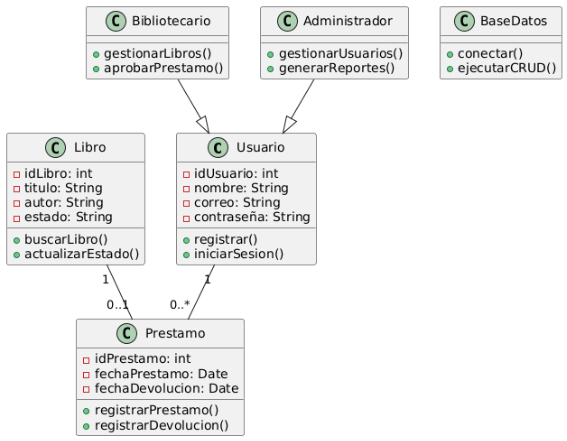El **Bibliotecario** y el **Administrador** tienen privilegios extendidos respecto al usuario normal.

- Diagrama de Secuencia:

Muestra el flujo de mensajes en un caso de uso específico, por ejemplo, “Solicitud de préstamo de libro”:

1. El Usuario selecciona un libro en la interfaz.
1. El Sistema valida disponibilidad.
1. Se registra el préstamo en la base de datos.
1. El Bibliotecario confirma la operación.
1. 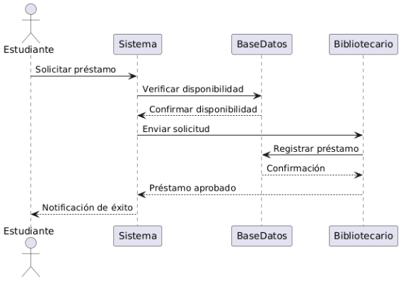El sistema devuelve una notificación de éxito.

- ## **Arquitectura propuesta:**
El sistema seguirá la arquitectura Modelo-Vista-Controlador (MVC):

- Modelo (Model): contiene las clases de negocio (Usuario, Libro, Prestamo, etc.) y la conexión a la base de datos mediante JDBC.
- Vista (View): interfaces gráficas desarrolladas en Java Swing para interacción con el usuario (formularios de login, gestión de libros, reportes).
- Controlador (Controller): clases que gestionan la comunicación entre Vista y Modelo, aplicando la lógica de los casos de uso.

Esta arquitectura asegura:

- Separación de responsabilidades.
- Facilidad para mantenimiento y escalabilidad.
- Integración futura con servicios web o aplicaciones móviles.
- ## **Alcance de la solución:**
La solución propuesta cubrirá los siguientes aspectos:

- Los **usuarios** podrán registrarse, iniciar sesión, consultar el catálogo y realizar préstamos/devoluciones.
- Los **bibliotecarios** gestionarán el catálogo de libros, aprobarán solicitudes y controlarán devoluciones.
- Los **administradores** tendrán control sobre usuarios y generación de reportes.
- El sistema garantizará integridad de datos mediante conexión a una base de datos relacional (MySQL).
- La arquitectura propuesta permitirá ampliar el sistema en el futuro, por ejemplo, integrando notificaciones por correo o reservas de libros en línea.

# **VII. IMPLEMENTACIÓN**
- ## **Descripción del desarrollo en Java:**
El sistema de Biblioteca Virtual fue implementado en el lenguaje **Java**, utilizando el paradigma de **programación orientada a objetos (POO)**.\
Se desarrollaron las clases principales:

- **Usuario** (clase base, con herencia hacia **Estudiante*,* Bibliotecario *y* Administrador**).
- **Libro** (gestión del catálogo).
- **Préstamo** (registro de préstamos y devoluciones).
- **BaseDatos** (simulación de operaciones CRUD).

El desarrollo se realizó en **Eclipse IDE**, estructurando el código en paquetes:

- **model** (clases del dominio)
- **service** (lógica de negocio)
- **ui** (interfaz con el usuario, en consola o visual)
- ## **Funcionalidades implementadas:**
1. Registro de usuarios.
1. Inicio de sesión y cierre de sesión.
1. Búsqueda de libros por título y autor.
1. Visualización de catálogo completo.
1. Registro, devolución y renovación de préstamos.
1. Gestión de libros (alta, edición, eliminación).
1. Aprobación de préstamos por el bibliotecario.
1. Bloqueo de usuarios morosos.
1. Gestión de permisos de administrador.
1. Generación de reportes de préstamos y devoluciones.
1. Notificación de operaciones exitosas o con error.
1. Consulta de historial de préstamos.
1. Validación de disponibilidad de libros.
1. Filtrado de libros por estado, categoría o editorial.
1. Registro de auditoría y control de inventario.
1. Exportación de reportes en PDF o Excel.
1. Manejo de reservas de libros.
1. Gestión de multas y pagos simulados.
1. Subida y descarga de copias digitales de libros.
1. ` `Validaciones de concurrencia y manejo de errores.
- ## **Manejo de errores y colecciones aplicadas:**
Se aplicaron excepciones (try-catch) en operaciones críticas como préstamos y búsquedas. Se utilizaron colecciones de Java para administrar los datos:

- ArrayList<Libro> para catálogo de libros.
- ArrayList<Usuario> para usuarios registrados.
- HashMap<Usuario, ArrayList<Prestamo>> para relacionar préstamos con usuarios.

***try {***

`    `***Prestamo p = new Prestamo(usuario, libro);***

`    `***prestamos.add(p);***

`    `***System.out.println("Préstamo registrado correctamente.");***

***} catch (Exception e) {***

`    `***System.out.println("Error al registrar el préstamo: " + e.getMessage());***

***}***

- ## **Ejemplos de código relevantes:**
Se incluyen fragmentos que ilustran la implementación:

- Clase **Libro** (atributos y métodos principales).

***public class Libro {***

`    `***private int idLibro;***

`    `***private String titulo;***

`    `***private String autor;***

`    `***private boolean disponible;***

`    `***public Libro(int id, String titulo, String autor) {***

`        `***this.idLibro = id;***

`        `***this.titulo = titulo;***

`        `***this.autor = autor;***

`        `***this.disponible = true;***

`    `***}***

`    `***public boolean isDisponible() {***

`        `***return disponible;***

`    `***}***

`    `***public void setDisponible(boolean disponible) {***

`        `***this.disponible = disponible;***

`    `***}***

`    `***@Override***

`    `***public String toString() {***

`        `***return idLibro + " - " + titulo + " (" + autor + ") - " +*** 

`               `***(disponible ? "Disponible" : "Prestado");***

`    `***}***

***}***

- Clase **ServicioBiblioteca** (registro de préstamo con validación de disponibilidad).

***public void registrarPrestamo(Usuario usuario, Libro libro) throws Exception {***

`    `***if (!libro.isDisponible()) {***

`        `***throw new Exception("El libro ya está prestado.");***

`    `***}***

`    `***libro.setDisponible(false);***

`    `***Prestamo prestamo = new Prestamo(usuario, libro);***

`    `***prestamos.add(prestamo);***

***}***

# **VIII. PROGRAMACIÓN VISUAL Y ACCESO A DATOS**
- ## **Interfaces gráficas desarrolladas:**
Se desarrollaron formularios en **Swing** para:

- Login y registro de usuarios.
- Consulta y filtrado de libros.
- Gestión de préstamos y devoluciones.
- Administración de libros y usuarios.
- Generación de reportes.
- ## **Conexión a base de datos (JDBC):**
El sistema se conectó a **SQLite mediante JDBC**:

- Creación de tablas: users, books, loans, reservations.
- Operaciones CRUD implementadas en la capa **service**.
- Scripts de creación y respaldo disponibles en el repositorio.

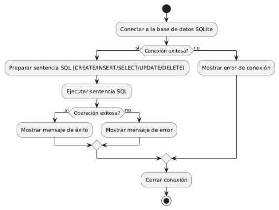

***public class BaseDatos {***

`    `***private Connection conexion;***

`    `***public void conectar() throws SQLException {***

`        `***String url = "jdbc:sqlite:biblioteca.db";***

`        `***conexion = DriverManager.getConnection(url);***

`        `***System.out.println("Conexión exitosa a SQLite");***

`    `***}***

`    `***public void cerrar() throws SQLException {***

`        `***if (conexion != null) {***

`            `***conexion.close();***

`            `***System.out.println("Conexión cerrada");***

`        `***}***

`    `***}***

`    `***public void agregarLibro(Libro libro) throws SQLException {***

`        `***String sql = "INSERT INTO books (idLibro, titulo, autor, disponible) VALUES (?, ?, ?, ?)";***

`        `***PreparedStatement stmt = conexion.prepareStatement(sql);***

`        `***stmt.setInt(1, libro.getIdLibro());***

`        `***stmt.setString(2, libro.getTitulo());***

`        `***stmt.setString(3, libro.getAutor());***

`        `***stmt.setBoolean(4, libro.isDisponible());***

`        `***stmt.executeUpdate();***

`        `***stmt.close();***

`    `***}***

***}***

# **IX. ACTIVIDAD DE RESPONSABILIDAD SOCIAL**
- ## **Breve descripción de la actividad realizada:**
El proyecto incluyó una actividad de **difusión y capacitación**:

- Se enseñó a estudiantes a registrar préstamos y usar la Biblioteca Virtual.
- Se promovió el uso de recursos digitales y el control responsable de libros.
- ## **Impacto esperado:**
Mayor eficiencia en la gestión de préstamos y concientización sobre el cuidado del material bibliográfico.

# **X. RESULTADOS**
- ## **Evidencia de ejecución del sistema:**
Registro de usuarios y gestión de roles funcionando.

Catálogo de libros con búsqueda y filtrado.

Préstamos y devoluciones registrados correctamente.
- ## **Pruebas realizadas:**
Pruebas unitarias básicas para clases críticas (DAO y servicio).

Pruebas de interfaz con escenarios típicos (login, préstamo, reserva).

Validaciones de reglas de negocio y manejo de errores.
- ## **Capturas de pantalla o reportes:**

# **XI. CONCLUSIONES**
- Se logró implementar un sistema funcional de Biblioteca Virtual con al menos 20 RFs.
- La arquitectura MVC permitió separar responsabilidades y facilitar mantenimiento.
- La integración con SQLite y JDBC demostró el manejo de persistencia.
- Los retos principales fueron manejo de concurrencia y validaciones de disponibilidad de libros, resueltos con colecciones y excepciones.
- El proyecto consolidó el aprendizaje de POO, UML, interfaces gráficas y persistencia.

# **XII. BIBLIOGRÁFIA**
Koha Community. (s. f.). Koha — *The fully featured, scalable library system*. Recuperado de <https://koha-community.org/>

Internet Archive. (s. f.). *Open Library*. Recuperado de <https://openlibrary.org/>

OCLC. (s. f.). *WorldCat*. Recuperado de <https://www.worldcat.org/>

DuraSpace. (s. f.). *DSpace – Open source repository software*. Recuperado de <https://duraspace.org/dspace/>

# **XIII. ANEXOS**
- ## **Código fuente: enlace al repositorio: <https://github.com/JeffTuesta01/BibliotecaVirtual-UPN.git>**

- ## **Interfaz gráfica Swing:**
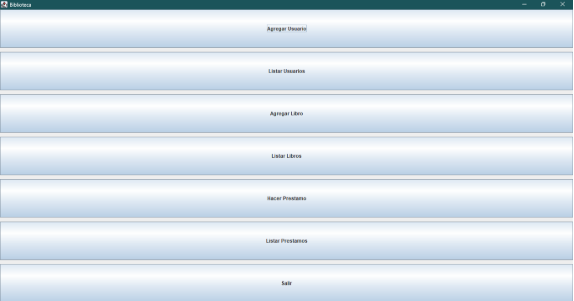

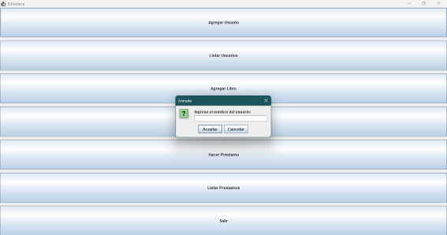

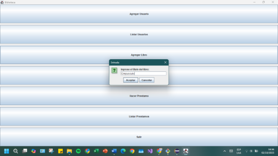

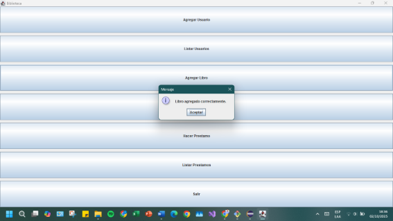

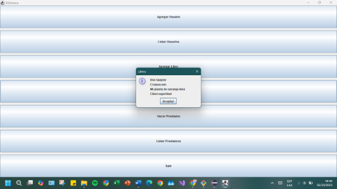

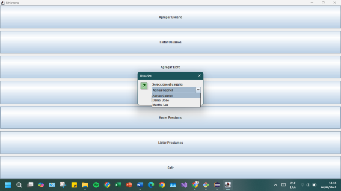

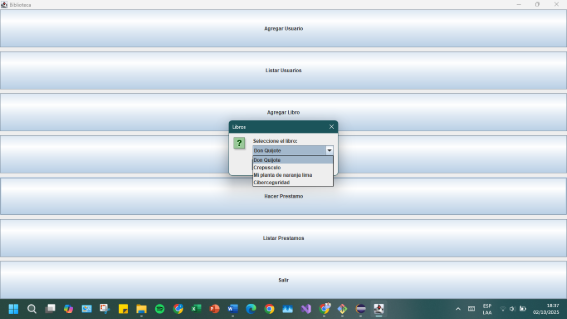

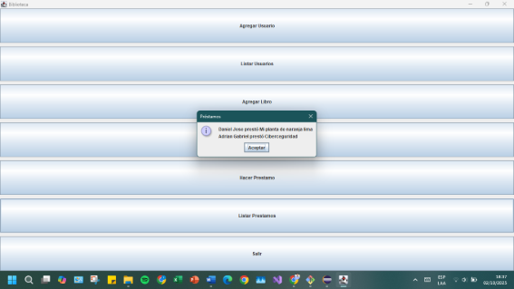

- ## 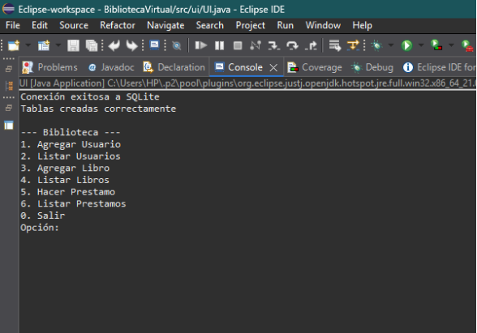**Código y consola:**

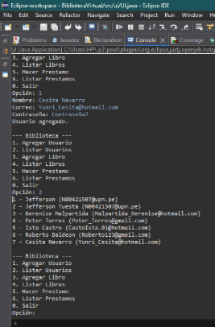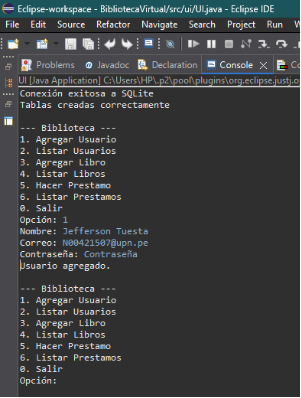

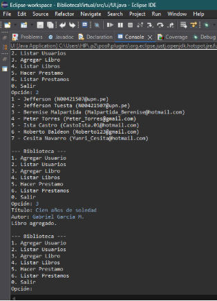

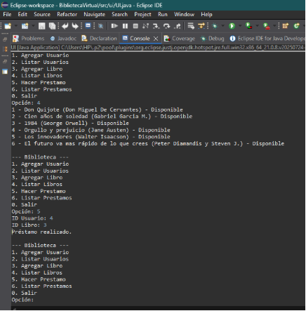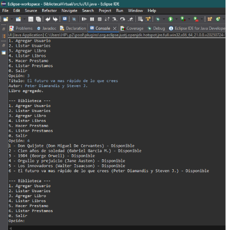

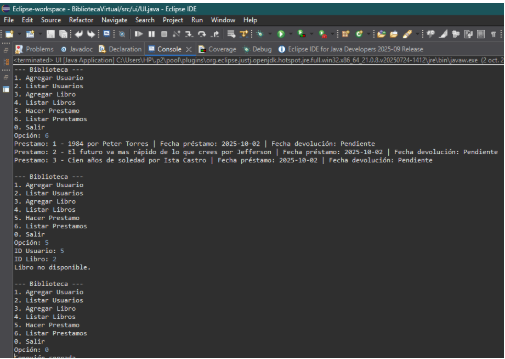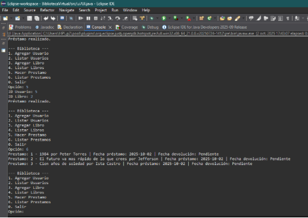

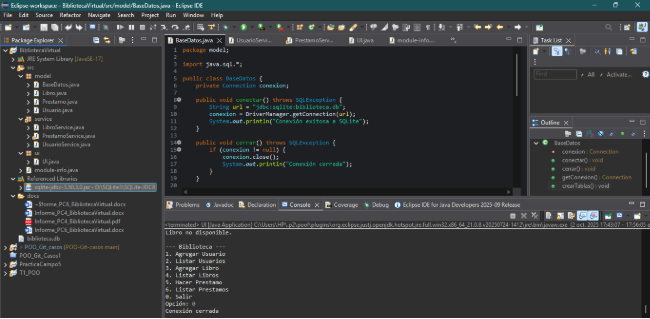

[ref1]: Aspose.Words.3003ee3d-284d-4b99-a49d-70aeef324df5.003.png
[ref2]: Aspose.Words.3003ee3d-284d-4b99-a49d-70aeef324df5.004.png
